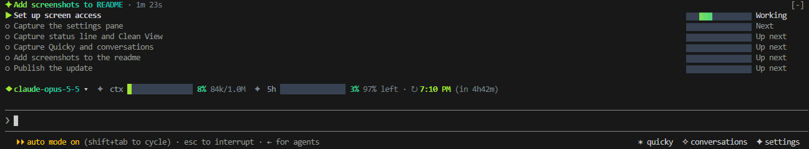
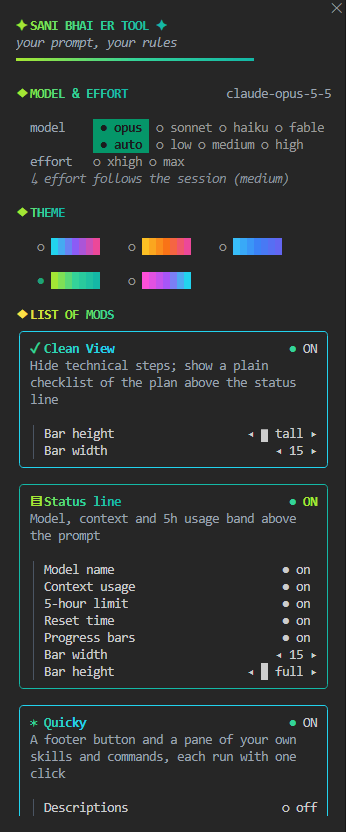
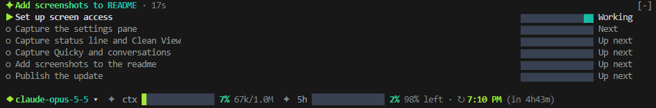
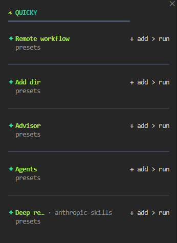
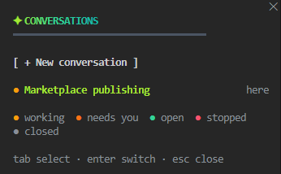

# Cockpit

A Claude Code mod that puts the controls you reach for most into one place: a settings pane with a model and effort picker, a usage status line, a conversations pane, a Quicky pane of your own skills, a Changes pane to accept or undo each edit, a Radar of flagged issues, and Clean View, a plain-English checklist of what Claude is doing.



Cockpit was previously called `usage-status`. On first start it brings over your saved `usage-status` settings.

## Install

```
/plugin marketplace add Mahtab12381/cockpit
/plugin install cockpit@local-mods
```

Restart Claude Code. Buttons for **✦ settings**, **✶ quicky** and **✧ conversations** then appear in the footer.

## Features

### Settings pane

Click **✦ settings** to open the pane. Press Tab to move between items, Enter to toggle one, and Esc to close.



- **Model & effort:** pick Opus 5.5, Sonnet 5.5, Haiku 5.5 or Fable 5.1, plus an effort level (`auto`, `low`, `medium`, `high`, `xhigh`, `max`). `auto` keeps the session's own effort setting.
- **Theme:** five gradients (aurora, sunset, ocean, forest, neon). Cockpit remembers the one you pick.
- **List of mods:** turn each of the features below on or off, and set its options.

### Status line

A band above the prompt that shows:

- the current model
- how much of the context window is used
- your 5-hour usage window and when it resets
- your weekly usage window and when it resets, with the weekday (for example `Mon 2:30 PM (in 3d4h)`)


You can hide any of these parts. You can also choose the bar width (5, 10 or 15 cells) and the bar height (thin, half, tall or full).

### Clean View

Clean View hides the technical tool rows. In their place it shows a short checklist of the plan above the status line, with a progress bar for each step. It also tells you in plain words when Claude needs your OK, has a question, is stuck or has stopped.

Claude fills the checklist through two tools that Cockpit provides, `plan_steps` and `report_progress`. Run `/simple` to turn Clean View on or off.



### Quicky

Quicky is a pane of your own skills and slash commands, and each one runs with one click.



- **What it lists:** your own commands (`mine`), the ones you use most (`most used`), or every command (`all`). Each can show its description and how many times you've used it.
- **Presets:** save the arguments you use often under a command so it runs in one press. If a preset still contains a placeholder such as `<ticket>`, Cockpit puts it in the prompt for you to fill in instead of running it.
- **Detect options:** asks the model to suggest presets for a command. This makes a small model call.

### Changes

Click **± changes** in the footer (or run `/changes`) to review every file edit Claude made in this conversation, one step at a time. The button shows how many steps are still to review.

- **Step by step:** each Edit, Write or NotebookEdit is one step. Use **◂ prev** and **next ▸**, or click a step in the list, to move between them. Each step shows its file, its diff, and how many lines it added and removed.
- **Accept or undo each step:** **✓ accept** keeps the step and moves to the next one. **↶ undo** takes just that step back out of the file, even when later steps changed other parts of the same file. An undone step can be put back with **↷ redo**. Undoing a step that created a file deletes the file.
- **All at once:** **✓ accept all** and **↶ undo all** (newest first) act on every step still to review. **clear reviewed** removes the accepted and undone steps from the list.

If a later edit changed the same lines, Cockpit won't undo the earlier step. Undo the later step first.

### Radar

Radar is a to-do list of things noticed along the way: bugs, risks, inconsistencies and tech debt that are outside the task, or part of it but worth flagging. Click **◎ radar** in the footer (or run `/radar`) to open it. The button shows how many items are open.

- **Claude flags what it notices:** while Radar is on, Claude is asked to call a `flag_issue` tool for each finding and then carry on with the task. A toast tells you when something new lands. Flagging the same title again updates the open item instead of adding a duplicate.
- **Each item** shows its kind (✗ bug, ⚠ risk, ≠ inconsistency, ◇ tech debt, • note), its severity, a short detail, the file, whether it belongs to the current task, and how long ago it was flagged.
- **Actions:** **→ fix** puts a fix request in the prompt for you to send. **✓ done** and **× dismiss** close an item, and **↺ reopen** brings it back. Press the severity to change it.
- **Your own notes:** type in the field at the bottom of the pane, or run `/radar <what you noticed>`.
- **Kept per project,** across sessions and `/clear`.

In settings you can turn off Claude's flagging (Radar becomes a plain notes list), the toast, details, file paths and the open count, and choose to sort by severity or newest.

### Conversations

A pane that lists this project's conversations, newest first. Click a row to switch to that conversation, or click **+ New conversation** to start a fresh one.



A colored dot shows each conversation's status:

| Status | Meaning |
|---|---|
| working | a turn is running |
| needs you | Claude asked for your OK or an answer |
| open | open in Claude Code and finished |
| stopped | the last turn failed or was cut off |
| closed | not open anywhere |

You can show 5, 10, 20 or 40 conversations. The status dots, the legend, the age column and the new-conversation button can each be turned off.

## Development

```
claude plugin validate .   # check the plugin and marketplace manifests
claude plugin test .       # run the tests in tests/
npx -p typescript tsc -p .  # type-check (needs the API types in .claude-plugin/types/)
claude plugin tag . --push # tag a release as cockpit--v<version>
```

| Path | Contents |
|---|---|
| `hooks/register.tsx` | the entry point: hooks, panes, the status line and commands |
| `hooks/clean-view.ts` | Clean View's checklist logic and wording |
| `hooks/conversations.ts` | reading and labelling conversations |
| `hooks/diff.ts` | line diffs, hunks, and undo/redo of each change step |
| `hooks/radar.ts` | Radar items: flagging, sorting, the flag tool and its guide |
| `hooks/quicky.ts` | listing, ranking and presets for Quicky |
| `hooks/theme.ts` | theme gradients |
| `hooks/view.ts` | builds the status line view |
| `types/index.d.ts` | shared types and the plugin's state shape |

Before you tag a release, bump `version` in `.claude-plugin/plugin.json`.
